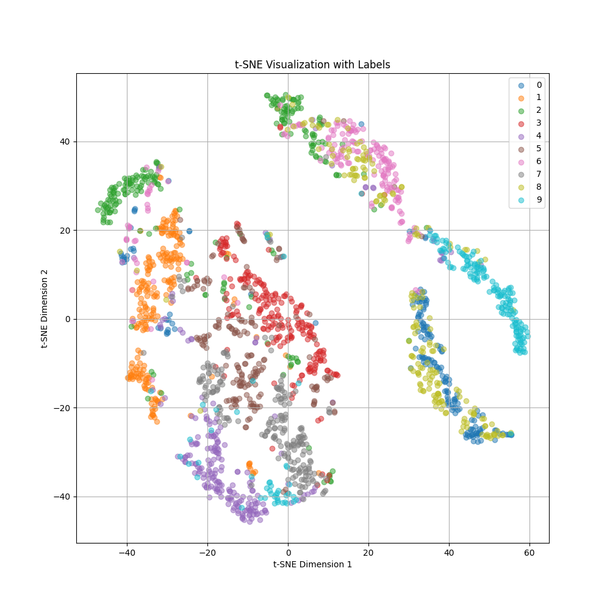

# Emb4Spa — Embeddings for Spatial Data

Master's project (MSc Artificial Intelligence, Vrije Universiteit Amsterdam).

**PoTAE** (Polygon Transformer AutoEncoder) is a hierarchical transformer-based
autoencoder that learns fixed-size embeddings of polygon shapes. It is pretrained
self-supervised by reconstructing 200 000 synthetic polygons, and the learned
representation is evaluated on a downstream task: classifying MNIST digits that
have been converted to polygon contours.

## Results

10-class classification of MNIST digit contours (10 000 train / 2 000 test polygons),
starting from the self-supervised pretrained encoder:

| Evaluation protocol | Accuracy |
|---------------------|----------|
| Fine-tuning (encoder + linear head, `main_finetune.py`) | **94.0 %** |
| Linear probing (frozen encoder, `main_linprob.py`) | 88.2 % |

t-SNE of the frozen 64-d embeddings, coloured by digit class — the classes
separate without any label supervision during pretraining:



Reconstruction quality of the autoencoder (original vs. reconstructed contours):
[output/mnist_reconstruction.png](output/mnist_reconstruction.png)

## How it works

### Input representation

A polygon is vectorized (`utils/vectorizer.py`, following the
[deep-geometry](https://github.com/SPINLab/deep-geometry) WKT vectorization) into a
sequence of at most 64 points with 7 features per point:

- `x, y` — coordinates
- 2-d one-hot — outer boundary vs. inner ring (hole)
- 3-d one-hot — action type: render / stop / full stop

### Architecture (`potae.py`)

The encoder is a stack of stages that each run transformer encoder layers and then
**halve the sequence length** (a linear projection `d_model → d_model/2` followed by
a reshape), so the sequence is progressively compressed. A final stage flattens the
remaining tokens into a single 64-dimensional embedding with LayerNorm. The decoder
mirrors this with sequence-doubling stages back to the full 64-point sequence.

Training loss combines MSE on the reconstructed coordinates with cross-entropy on
the two one-hot channels.

For downstream classification, `pot.py` reuses the encoder and replaces the decoder
with a linear classification head.

## Repository layout

| Path | Purpose |
|------|---------|
| `potae.py` / `pot.py` | Autoencoder and encoder-classifier models |
| `main_pretrain.py` | Self-supervised reconstruction pretraining on synthetic polygons |
| `main_finetune.py` | Downstream MNIST-polygon classification (full fine-tuning) |
| `main_linprob.py` | Linear probing on the frozen encoder |
| `main_+mlp.py` | MLP classifier on frozen PoTAE embeddings |
| `evaluate.py` | Accuracy, t-SNE embedding plots, reconstruction plots |
| `utils/generate_polygon.py` | Synthetic polygon dataset generation (`polygenerator` + `shapely`) |
| `utils/mnist2polygon.py` | MNIST images → polygon contours |
| `experiments/` | Exploratory notebooks (LSTM/Conv/hierarchical-transformer autoencoder baselines) |

## Running it

Requires Python 3.10+ and the packages in `requirement.txt` (PyTorch, shapely,
polygenerator, deep-geometry, scikit-learn, matplotlib, wandb).

```bash
pip install -r requirement.txt

# 1. Generate datasets (gitignored, created locally)
python utils/generate_polygon.py     # synthetic pretraining polygons
python utils/mnist2polygon.py        # MNIST → polygon contours

# 2. Self-supervised pretraining (config used for the results above:
#    d_model 384, 6 heads, FFN 1024, 2 layers per stage, batch 512, 200 epochs)
bash run_pretrain.sh

# 3. Downstream evaluation
bash run_finetune.sh                 # fine-tuning
python main_linprob.py               # linear probing
```

Training runs log to [Weights & Biases](https://wandb.ai) by default; pass
`--no_wandb` to disable.
